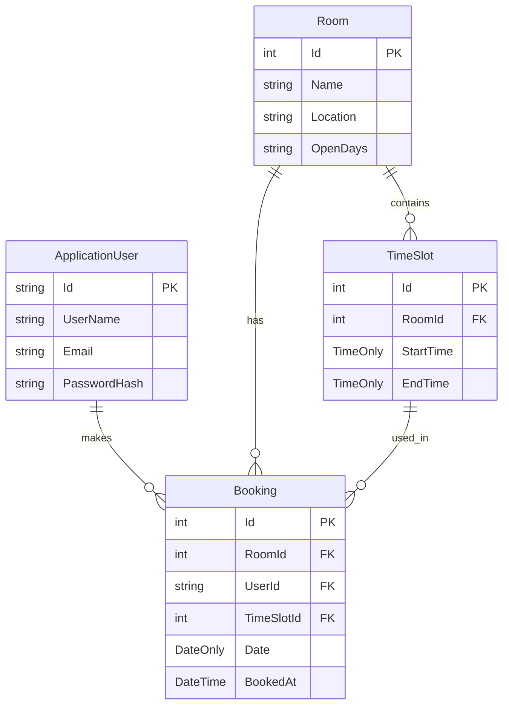

# Room Booking System

A modern web application for managing room bookings, built with ASP.NET Core MVC. This system allows users to book rooms for specific time slots, with features for both regular users and administrators.

## Features

### User Features
- User registration and authentication
- Room browsing and availability checking
- Booking management (create, view, cancel bookings)
- Personal booking history

### Admin Features
- User management (view, promote to admin, delete users)
- Room management (create, edit, delete rooms)
- Time slot management for each room
- Booking oversight and management
- Dashboard with minor system statistics

## Technical Stack

- **Backend**: ASP.NET Core MVC
- **Database**: SQLite
- **Authentication**: ASP.NET Core Identity
- **Frontend**: 
  - Bootstrap 5
  - Font Awesome
  - jQuery
- **API**: RESTful API with Swagger/OpenAPI support

## Prerequisites

- .NET 8.0 SDK or later
- Visual Studio 2022 or Visual Studio Code
- SQLite (included with .NET)

## Installation

1. Clone the repository:
   ```bash
   git clone [repository-url]
   cd BookingSite
   ```

2. Restore dependencies:
   ```bash
   dotnet restore
   ```

3. Update the database:
   ```bash
   dotnet ef database update
   ```

4. Run the application:
   ```bash
   dotnet run
   ```

5. Access the application at `https://localhost:5001` or `http://localhost:5000`

## Project Structure

```
BookingSite/
├── Controllers/           # MVC Controllers
│   ├── Api/              # API Controllers
│   ├── AdminController   # Admin dashboard and management
│   ├── AuthController    # Authentication and user management
│   ├── BookingController # Booking operations
│   └── HomeController    # Main application controller
├── Models/               # Data models
│   ├── ApplicationUser   # User model
│   ├── Booking          # Booking model
│   ├── Room             # Room model
│   └── TimeSlot         # Time slot model
├── Views/                # Razor views
│   ├── Admin/           # Admin views
│   ├── Booking/         # Booking views
│   └── Shared/          # Shared layouts and partials
├── wwwroot/             # Static files
│   ├── css/            # Stylesheets
│   ├── js/             # JavaScript files
│   └── lib/            # Third-party libraries
└── Data/                # Database context and configurations
```

## Database Schema



## API Endpoints
These can be found in a swagger endpoint aswell, at /swagger, only in development however.
Theres no innate security for these as the website security wasent important.

### Users API
- `GET /api/Users` - Get all users with their roles
- `GET /api/Users/{id}` - Get user by ID
- `POST /api/Users` - Create new user
- `PUT /api/Users/{id}` - Update user
- `DELETE /api/Users/{id}` - Delete user
- `GET /api/Users/roles` - Get all available roles
- `POST /api/Users/roles` - Add user to role
- `DELETE /api/Users/roles/{roleName}` - Remove role from user

### Rooms API
- `GET /api/Rooms` - Get all rooms
- `GET /api/Rooms/{id}` - Get room by ID
- `POST /api/Rooms` - Create new room
- `PUT /api/Rooms/{id}` - Update room
- `DELETE /api/Rooms/{id}` - Delete room

### TimeSlots API
- `GET /api/TimeSlots` - Get all time slots
- `GET /api/TimeSlots/{id}` - Get time slot by ID
- `POST /api/TimeSlots` - Create new time slot
- `PUT /api/TimeSlots/{id}` - Update time slot
- `DELETE /api/TimeSlots/{id}` - Delete time slot

### Bookings API
- `GET /api/Bookings` - Get all bookings
- `GET /api/Bookings/{id}` - Get booking by ID
- `POST /api/Bookings` - Create new booking
- `PUT /api/Bookings/{id}` - Update booking
- `DELETE /api/Bookings/{id}` - Delete booking

## Development

### Database Migrations
To create a new migration:
```bash
dotnet ef migrations add [MigrationName]
```

To update the database:
```bash
dotnet ef database update
```

### Running Tests
```bash
dotnet test
```

## Security

- Authentication using ASP.NET Core Identity
- Role-based authorization (Admin/User)
- CSRF protection
- Input validation
- Secure password hashing

## Contributing

1. Fork the repository
2. Create a feature branch
3. Commit your changes
4. Push to the branch
5. Create a Pull Request

## License

This project is licensed under the MIT License - see the LICENSE file for details.

## Acknowledgments

- Bootstrap for the UI framework
- Font Awesome for icons
- ASP.NET Core team for the framework 